# FluxOps – Continuous and Automated IT Operations

FluxOps is an educational DevOps command and deployment assistant designed for students and beginners. It helps users learn and use common **Linux, Git, Docker, Jenkins, AWS CLI, and Kubernetes** commands through clear explanations, real examples, troubleshooting solutions, and step-by-step deployment guides.

> **Tagline:** Continuous and Automated IT Operations

FluxOps is an educational frontend application. It does not execute terminal commands or modify cloud resources. All commands are provided as reference material for users to run manually in their own environments.

---

## Project Overview

FluxOps combines a beginner-friendly DevOps learning platform with a practical containerization and CI/CD deployment workflow.

The application is developed using **React, Vite, TypeScript, and Tailwind CSS**, containerized using **Docker**, published to **Docker Hub**, and deployed to **Kubernetes** through an automated **Jenkins CI/CD pipeline**.

### Application Workflow

```text
User
 │
 ▼
FluxOps Web Application
 │
 ├── Commands Library
 ├── Learning Paths
 ├── Docker Guide
 ├── AWS EC2 Guide
 └── Troubleshooting
```

### CI/CD Workflow

```text
Developer
    │
    ▼
GitHub
    │
    ▼
GitHub Webhook
    │
    ▼
Jenkins
    │
    ├── Checkout Code
    │
    ├── Docker Login
    │
    ├── Build Docker Image
    │
    ├── Push Docker Image
    │
    ├── Deploy to Kubernetes
    │
    └── Verify Deployment
    │
    ▼
Docker Hub
    │
    ▼
Kubernetes / Minikube
    │
    ▼
FluxOps Application
```

---

# Main Features

## DevOps Learning Features

* Search commands by title, command text, explanation, category, or example
* Filter commands by category
* Categories include:

  * Linux
  * Git
  * Docker
  * Jenkins
  * AWS CLI
  * Kubernetes
* Copy commands to the clipboard
* Save favourite commands using LocalStorage
* Track learning progress
* Structured DevOps learning paths
* Step-by-step Docker deployment guide
* Beginner-friendly AWS EC2 setup guide
* Troubleshooting solutions for common deployment issues
* Dark mode and light mode
* Fully responsive design for desktop, tablet, and mobile

---

# Technology Stack

| Technology   | Purpose                              |
| ------------ | ------------------------------------ |
| React        | Frontend UI                          |
| Vite         | Build tool and development server    |
| TypeScript   | Type-safe JavaScript                 |
| Tailwind CSS | UI styling                           |
| React Router | Client-side routing                  |
| Lucide React | Icons                                |
| LocalStorage | Saved commands and learning progress |
| Nginx        | Production web server                |
| Docker       | Application containerization         |
| Jenkins      | CI/CD automation                     |
| Docker Hub   | Container image registry             |
| Kubernetes   | Container orchestration              |
| Minikube     | Kubernetes cluster for deployment    |
| GitHub       | Source code management               |

### Project does not use

* Supabase
* Firebase
* Authentication
* External databases
* Serverless functions
* Paid APIs
* Environment variables

---

# Application Pages

| Page           | Description                                                                |
| -------------- | -------------------------------------------------------------------------- |
| Home           | Landing page with search, categories, popular commands, and learning paths |
| Commands       | Searchable and filterable DevOps commands library                          |
| Docker Guide   | Step-by-step Docker deployment guide                                       |
| EC2 Guide      | Beginner-friendly AWS EC2 setup checklist                                  |
| Learning Paths | Structured learning paths with progress tracking                           |
| Saved Commands | Saved favourite commands                                                   |
| About          | Information about FluxOps                                                  |

---

# Project Structure

```text
fluxops/
├── Dockerfile
├── .dockerignore
├── nginx.conf
├── deployment.yml
├── service.yml
├── index.html
├── package.json
├── vite.config.ts
├── tailwind.config.js
├── postcss.config.js
├── tsconfig.json
├── src/
│   ├── main.tsx
│   ├── App.tsx
│   ├── index.css
│   ├── components/
│   │   ├── Navbar.tsx
│   │   ├── MobileMenu.tsx
│   │   ├── Footer.tsx
│   │   ├── Layout.tsx
│   │   ├── SearchBar.tsx
│   │   ├── CategoryCard.tsx
│   │   ├── CommandCard.tsx
│   │   ├── CopyButton.tsx
│   │   ├── TerminalBlock.tsx
│   │   ├── ProgressCard.tsx
│   │   ├── TroubleshootingAccordion.tsx
│   │   ├── EmptyState.tsx
│   │   ├── PageHeading.tsx
│   │   └── ThemeToggle.tsx
│   ├── context/
│   │   └── ThemeContext.tsx
│   ├── data/
│   │   ├── commands.ts
│   │   ├── learningPaths.ts
│   │   └── troubleshooting.ts
│   ├── hooks/
│   │   ├── useSavedCommands.ts
│   │   ├── useLearningProgress.ts
│   │   └── useEC2Checklist.ts
│   └── pages/
│       ├── HomePage.tsx
│       ├── CommandsPage.tsx
│       ├── DockerGuidePage.tsx
│       ├── EC2GuidePage.tsx
│       ├── LearningPathsPage.tsx
│       ├── SavedCommandsPage.tsx
│       ├── AboutPage.tsx
│       └── NotFoundPage.tsx
```

---

# GitHub Repository

Source code:

**https://github.com/saad7804/fluxops**

Main branch:

```text
main
```

Clone the repository:

```bash
git clone https://github.com/saad7804/fluxops.git
cd fluxops
```

---

# Local Installation

Install project dependencies:

```bash
npm install
```

Start the development server:

```bash
npm run dev
```

The development server will display the local URL in the terminal.

---

# Production Build

Create the production build:

```bash
npm run build
```

The production files are generated inside:

```text
dist/
```

---

# Docker

## Docker Image

The application is packaged as:

```text
saadmomin7804/fluxops:latest
```

Docker Hub repository:

**https://hub.docker.com/r/saadmomin7804/fluxops**

## Dockerfile

The project uses a multi-stage Docker build.

### Build Stage

The Node.js Alpine image installs dependencies and creates the production build.

### Production Stage

The generated application is served using Nginx Alpine.

```dockerfile
FROM node:20-alpine AS build

WORKDIR /app

COPY package*.json ./

RUN npm ci

COPY . .

RUN npm run build

FROM nginx:alpine

COPY nginx.conf /etc/nginx/conf.d/default.conf

COPY --from=build /app/dist /usr/share/nginx/html

EXPOSE 80

CMD ["nginx", "-g", "daemon off;"]
```

---

# Build and Run Docker Container

Build the image:

```bash
docker build -t fluxops:v1 .
```

Run the container:

```bash
docker run -d \
  --name fluxops-container \
  --restart always \
  -p 80:80 \
  fluxops:v1
```

Check the running container:

```bash
docker ps
```

View container logs:

```bash
docker logs fluxops-container
```

Open the application:

```text
http://localhost
```

---

# AWS EC2 Deployment

The application can also be deployed manually on an Ubuntu AWS EC2 instance.

## 1. Launch EC2

Launch an Ubuntu EC2 instance and configure the security group to allow:

```text
SSH  - TCP 22
HTTP - TCP 80
```

## 2. Connect to EC2

```bash
ssh -i your-key.pem ubuntu@YOUR_EC2_PUBLIC_IP
```

## 3. Install Git and Docker

```bash
sudo apt update
sudo apt upgrade -y

sudo apt install git docker.io -y

sudo systemctl enable docker
sudo systemctl start docker

sudo usermod -aG docker ubuntu
newgrp docker
```

## 4. Clone FluxOps

```bash
git clone https://github.com/saad7804/fluxops.git

cd fluxops
```

## 5. Build the Docker Image

```bash
docker build -t fluxops:v1 .
```

## 6. Run the Application

```bash
docker run -d \
  --name fluxops-container \
  --restart always \
  -p 80:80 \
  fluxops:v1
```

The application can then be accessed using:

```text
http://YOUR_EC2_PUBLIC_IP
```

---

# Kubernetes Deployment

FluxOps can be deployed to Kubernetes using the included Kubernetes manifests.

The CI/CD deployment uses:

```text
Namespace: fluxops
Deployment: fluxops
Service: fluxops-service
Replicas: 2
Container Port: 80
Service Type: NodePort
NodePort: 30007
```

## Create Namespace

```bash
kubectl create namespace fluxops
```

## Deploy Application

```bash
kubectl apply -f deployment.yml
kubectl apply -f service.yml
```

## Verify Deployment

```bash
kubectl get deployments -n fluxops
kubectl get pods -n fluxops
kubectl get services -n fluxops
kubectl get all -n fluxops
```

---

# Kubernetes Manifests

## Deployment

The FluxOps Deployment runs two application replicas.

```yaml
apiVersion: apps/v1
kind: Deployment
metadata:
  name: fluxops
  namespace: fluxops
spec:
  replicas: 2
  selector:
    matchLabels:
      app: fluxops
  template:
    metadata:
      labels:
        app: fluxops
    spec:
      containers:
        - name: fluxops
          image: saadmomin7804/fluxops:latest
          imagePullPolicy: Always
          ports:
            - containerPort: 80
```

## Service

The application is exposed through a Kubernetes NodePort service.

```yaml
apiVersion: v1
kind: Service
metadata:
  name: fluxops-service
  namespace: fluxops
spec:
  type: NodePort
  selector:
    app: fluxops
  ports:
    - port: 80
      targetPort: 80
      nodePort: 30007
```

---

# CI/CD Pipeline with Jenkins

The project implements a complete Jenkins CI/CD pipeline for automatically building, publishing, deploying, and verifying the FluxOps application.

## CI/CD Flow

```text
GitHub Push
     │
     ▼
GitHub Webhook
     │
     ▼
Jenkins
     │
     ├── Checkout Code
     │
     ├── Docker Login
     │
     ├── Build Docker Image
     │
     ├── Push Docker Image
     │
     ├── Deploy to Kubernetes
     │
     └── Verify Deployment
     │
     ▼
Docker Hub
     │
     ▼
Kubernetes / Minikube
     │
     ▼
FluxOps Application
```

---

# Jenkins Pipeline Stages

## 1. Checkout Code

Jenkins checks out the `main` branch from:

```text
https://github.com/saad7804/fluxops.git
```

## 2. Docker Login

Jenkins authenticates with Docker Hub using the configured credential:

```text
docker_creds
```

## 3. Build Docker Image

Jenkins builds:

```text
saadmomin7804/fluxops:latest
```

using the project Dockerfile.

## 4. Push Docker Image

The Docker image is pushed to Docker Hub.

## 5. Deploy to Kubernetes

Jenkins uses the Kubernetes kubeconfig credential:

```text
kubeconfig
```

The pipeline:

* Creates the `fluxops` namespace if required
* Applies `deployment.yml`
* Applies `service.yml`
* Restarts the FluxOps deployment
* Waits for the rollout to complete

## 6. Verify Deployment

Jenkins verifies:

```bash
kubectl get pods -n fluxops
kubectl get svc -n fluxops
kubectl get deployment -n fluxops
kubectl get all -n fluxops
```

---

# Jenkins Pipeline

The pipeline used for the project:

```groovy
pipeline {
    agent any

    environment {
        IMAGE = "saadmomin7804/fluxops"
        TAG = "latest"
    }

    stages {

        stage('Checkout Code') {
            steps {
                git branch: 'main',
                    url: 'https://github.com/saad7804/fluxops.git'
            }
        }

        stage('Docker Login') {
            steps {
                withCredentials([
                    usernamePassword(
                        credentialsId: 'docker_creds',
                        usernameVariable: 'DOCKER_USER',
                        passwordVariable: 'DOCKER_PASS'
                    )
                ]) {
                    sh '''
                        echo "$DOCKER_PASS" | docker login \
                        -u "$DOCKER_USER" \
                        --password-stdin
                    '''
                }
            }
        }

        stage('Build Docker Image') {
            steps {
                sh '''
                    docker build -t ${IMAGE}:${TAG} .
                '''
            }
        }

        stage('Push Docker Image') {
            steps {
                sh '''
                    docker push ${IMAGE}:${TAG}
                '''
            }
        }

        stage('Deploy to Kubernetes') {
            steps {
                withCredentials([
                    file(
                        credentialsId: 'kubeconfig',
                        variable: 'KUBECONFIG_FILE'
                    )
                ]) {
                    sh '''
                        export KUBECONFIG="$KUBECONFIG_FILE"

                        echo "===== Creating Namespace ====="
                        kubectl create namespace fluxops \
                        --dry-run=client -o yaml | kubectl apply -f -

                        echo "===== Deploying Application ====="
                        kubectl apply -f deployment.yml
                        kubectl apply -f service.yml

                        echo "===== Restarting Deployment ====="
                        kubectl rollout restart deployment/fluxops -n fluxops

                        echo "===== Waiting for Deployment ====="
                        kubectl rollout status deployment/fluxops -n fluxops
                    '''
                }
            }
        }

        stage('Verify Deployment') {
            steps {
                withCredentials([
                    file(
                        credentialsId: 'kubeconfig',
                        variable: 'KUBECONFIG_FILE'
                    )
                ]) {
                    sh '''
                        export KUBECONFIG="$KUBECONFIG_FILE"

                        echo "===== PODS ====="
                        kubectl get pods -n fluxops -o wide

                        echo "===== SERVICES ====="
                        kubectl get svc -n fluxops

                        echo "===== DEPLOYMENT ====="
                        kubectl get deployment -n fluxops

                        echo "===== ALL RESOURCES ====="
                        kubectl get all -n fluxops
                    '''
                }
            }
        }
    }

    post {
        always {
            sh 'docker logout || true'
        }

        success {
            echo 'FluxOps CI/CD pipeline completed successfully!'
        }

        failure {
            echo 'FluxOps CI/CD pipeline failed. Check the Console Output.'
        }
    }
}
```

---

# Jenkins Credentials

The Jenkins pipeline uses two credentials.

## Docker Hub Credential

Credential ID:

```text
docker_creds
```

This credential contains the Docker Hub username and Personal Access Token.

## Kubernetes Credential

Credential ID:

```text
kubeconfig
```

The Kubernetes configuration is stored in Jenkins as a Secret File credential.

This allows Jenkins to authenticate with the Kubernetes cluster during deployment.

---

# GitHub Webhook

A GitHub webhook is implemented to connect the GitHub repository with Jenkins.

Webhook endpoint:

```text
http://13.235.95.244:8080/github-webhook/
```

The webhook is configured for **Push events**.

When changes are pushed to the GitHub repository, the webhook triggers the Jenkins CI/CD workflow.

```text
Git Push
   ↓
GitHub Webhook
   ↓
Jenkins
   ↓
Build
   ↓
Docker Hub
   ↓
Kubernetes
```

---

# Accessing the Kubernetes Application

The FluxOps Kubernetes Service is exposed using NodePort `30007`.

For the demonstrated EC2 Minikube deployment, the application can also be accessed using Kubernetes port forwarding:

```bash
kubectl port-forward \
  --address 0.0.0.0 \
  service/fluxops-service \
  9090:80 \
  -n fluxops
```

The application can then be accessed through:

```text
http://YOUR_EC2_PUBLIC_IP:9090
```

---

# Troubleshooting

## Docker Permission Denied

```bash
sudo usermod -aG docker $USER
newgrp docker
```

## Port 80 Already in Use

```bash
sudo lsof -i :80
```

## Container Name Already Exists

```bash
docker rm -f fluxops-container
```

## No Space Left on Device

Check Docker disk usage:

```bash
docker system df
```

Clean unused Docker resources:

```bash
docker system prune -a
```

## React Router Returns 404 After Refresh

Make sure `nginx.conf` contains:

```nginx
try_files $uri $uri/ /index.html;
```

## EC2 Public IP Not Opening

Check:

```bash
docker ps
```

Make sure the FluxOps container is running.

Also verify that port `80` is allowed in the EC2 security group.

If UFW is enabled:

```bash
sudo ufw allow 80/tcp
```

## Kubernetes Pods Not Running

Check:

```bash
kubectl get pods -n fluxops
```

Inspect a pod:

```bash
kubectl describe pod POD_NAME -n fluxops
```

Check deployment status:

```bash
kubectl rollout status deployment/fluxops -n fluxops
```

---

# Project Screenshots

## Application

### Home Page


### Commands Library


### Docker Guide


### EC2 Guide


### Learning Paths


### Saved Commands


### About Page


### Dark Mode


### Light Mode


---

# DevOps and Infrastructure Screenshots

### 01. Docker Installation


### 02. FluxOps Repository Cloned

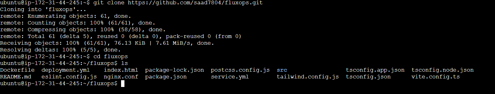

### 03. Docker Image

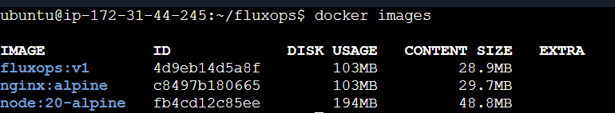

### 04. Minikube Cluster

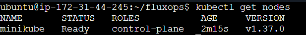

### 05. Local Kubernetes Deployment

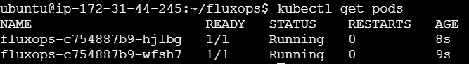

### 06. Local Kubernetes Application

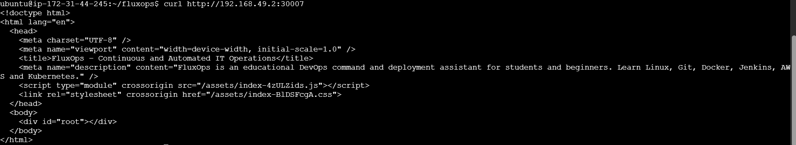

### 07. Kubernetes Verification

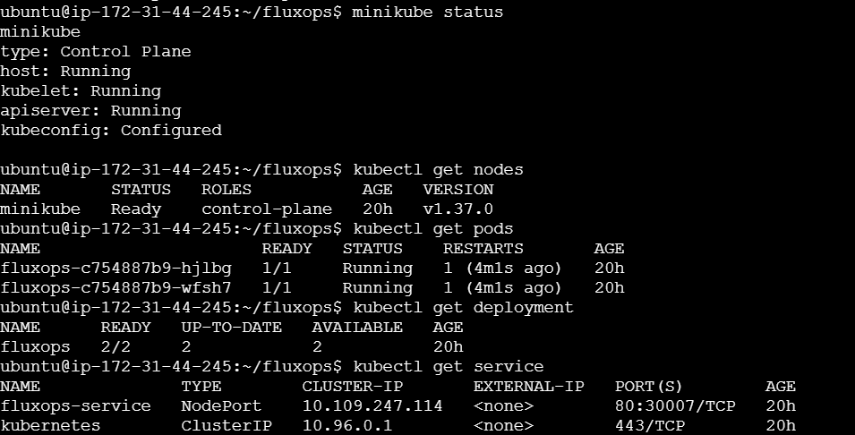

### 08. Amazon ECR Image

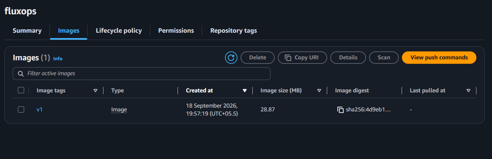

### 09. Amazon EKS Cluster

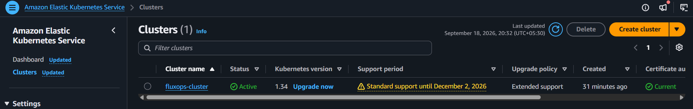

### 10. EKS Fargate Profile

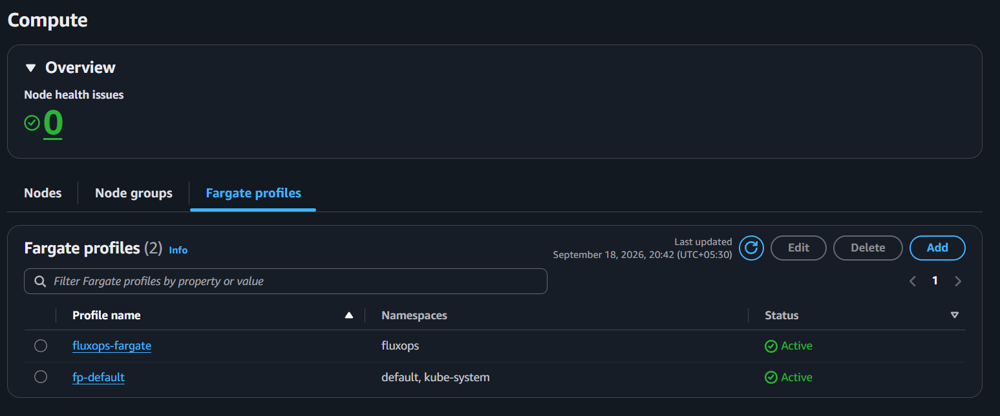

### 11. EKS Application

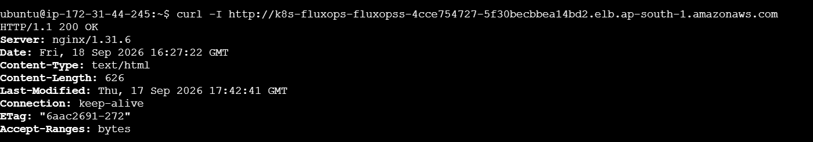

### 12. EKS Pods Running

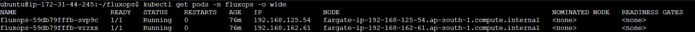

### 13. EKS Verification

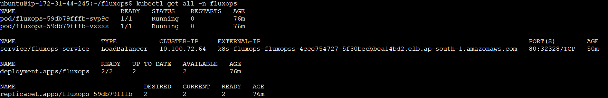

---

# CI/CD Screenshots

### 14. Jenkins Pipeline


### 15. Jenkins Successful Build


### 16. Docker Hub Image


### 17. Kubernetes Pods


### 18. FluxOps Application After CI/CD Deployment


### 19. GitHub Webhook


---

# Project Results

The completed project demonstrates:

* Source code management using Git and GitHub
* GitHub webhook integration with Jenkins
* Docker-based application containerization
* Docker image publishing to Docker Hub
* Jenkins-based CI/CD automation
* Kubernetes deployment using Minikube
* Kubernetes namespace management
* Kubernetes Deployments
* Kubernetes Services
* Two application replicas
* Automated deployment verification
* Application access after successful deployment

The complete workflow is:

```text
GitHub
   ↓
GitHub Webhook
   ↓
Jenkins
   ↓
Checkout Code
   ↓
Docker Login
   ↓
Docker Build
   ↓
Docker Push
   ↓
Kubernetes Deployment
   ↓
Deployment Verification
   ↓
FluxOps Application
```

---

# Learning Outcomes

Through this project, the following practical DevOps concepts were implemented:

* Git and GitHub
* Linux and Ubuntu administration
* Docker
* Docker Hub
* Jenkins
* Jenkins Credentials
* CI/CD Pipelines
* GitHub Webhooks
* Kubernetes
* Minikube
* Kubernetes Deployments
* Kubernetes Services
* Kubernetes Namespaces
* Containerized Application Deployment
* AWS EC2
* Amazon ECR
* Amazon EKS
* AWS Fargate

---

# Future Enhancements

Possible future improvements include:

* Use versioned Docker image tags instead of only `latest`
* Add automated application tests before Docker image publishing
* Add code-quality and security scanning
* Add Prometheus and Grafana monitoring
* Add Kubernetes Ingress
* Add HTTPS/TLS
* Deploy the CI/CD workflow to Amazon EKS
* Add automated rollback for failed deployments
* Add additional DevOps learning modules
* Add more troubleshooting scenarios

---

# Conclusion

FluxOps demonstrates how a beginner-friendly DevOps learning application can be combined with a practical CI/CD deployment workflow.

The project progresses from application development and version control to containerization, Docker image publishing, GitHub webhook integration, Jenkins automation, Kubernetes deployment, and application verification.

The implementation provides a practical demonstration of how commonly used DevOps tools can work together to create a repeatable and automated application delivery workflow.

---

# Author

**Saad Momin**

GitHub:
https://github.com/saad7804

LinkedIn:
https://linkedin.com/in/saadmomin

---

© FluxOps. Built for learning DevOps.
